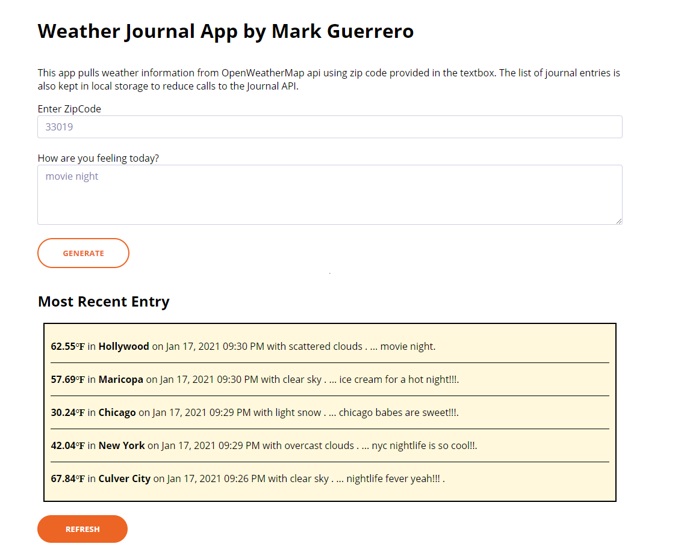

# Weather Journal App with Asynchronous JavaScript

This project requires you to create an asynchronous web app that uses Web API and user data to dynamically update the UI in a Weather Journal application.



## Installation

Use the package manager to install Weather Journal.

```
git clone https://github.com/visualtechnet/weather-journal-ui.git
```

### Client

1. Install live-server globally

```
yarn add --global live-server
```

2. Go to Client folder and install dependencies

```
live-server
```

3. Visit Site

```
http://localhost:8080
```

## Hosting

Server and Client is hosted in netlify. Server uses netlify aws lambda functions

[https://gifted-montalcini-db32f9.netlify.app/](https://gifted-montalcini-db32f9.netlify.app/)